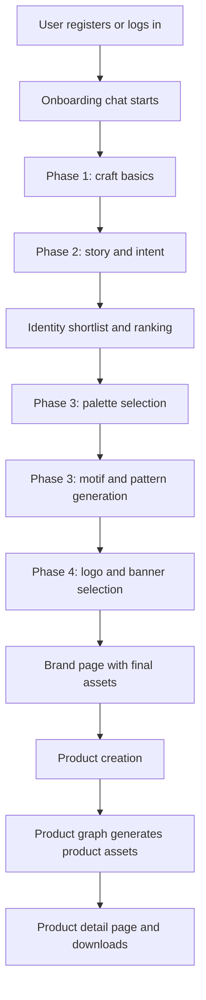
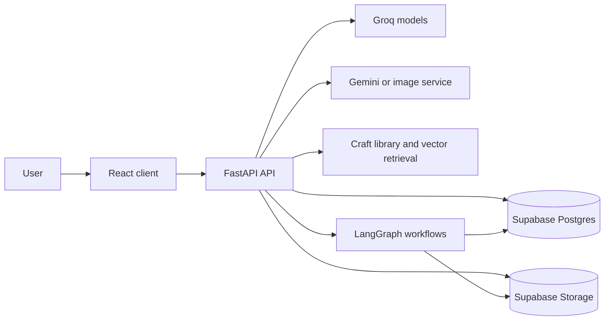
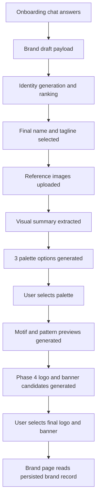
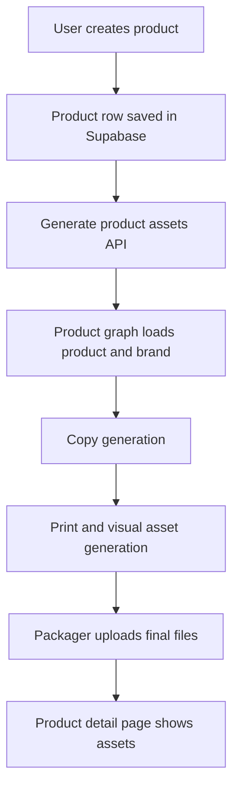

# Idanta

Idanta is an AI-assisted brand and product system for Indian artisans. The repo contains a FastAPI backend and a React frontend that work together to:

- onboard an artisan through guided chat
- turn craft context into a brand identity
- let the user choose a final name, tagline, palette, motif, pattern, logo, and banner
- generate a downloadable brand kit
- create category-aware product assets such as branded photos, labels, hang tags, story cards, and certificates

This README explains the whole monorepo at a high level. Detailed implementation notes for each app live in:

- [server/README.md](/c:/Users/sir_anmol/Desktop/Idanta/server/README.md)
- [client/README.md](/c:/Users/sir_anmol/Desktop/Idanta/client/README.md)

## Monorepo Shape

```text
Idanta/
├── client/   # React + TypeScript + Vite frontend
├── server/   # FastAPI + LangGraph + Supabase backend
└── README.md
```

## What The Product Does

Idanta is built around two connected pipelines:

1. `Brand pipeline`
2. `Product pipeline`

The brand pipeline builds the visual and verbal identity of an artisan brand. The product pipeline uses that finished brand system to create product-facing assets.

## Core Product Journey



## Repo Responsibilities

### `server/`

The backend owns:

- authentication APIs
- onboarding and generation APIs
- Supabase read/write operations
- craft context loading and RAG retrieval
- LangGraph orchestration for brand and product generation
- prompt building for text and image generation
- PDF and downloadable kit packaging
- job tracking

### `client/`

The frontend owns:

- auth screens
- onboarding chat UX
- Phase 1 to Phase 4 selection flow
- voice recording and text-to-speech playback
- brand page and product pages
- local onboarding draft persistence
- API calls and query caching

## System Architecture



## Brand Pipeline Summary

The current onboarding flow is intentionally staged:

### Phase 1

The user provides foundational artisan context:

- craft
- region
- years of experience
- generations in craft
- occasion
- target customer

### Phase 2

The user provides brand-story direction:

- values
- vision
- mission

### Identity stage

The backend proposes name and tagline sets. The user:

- reviews candidate sets
- shortlists
- ranks
- locks a final pair

### Phase 3

The user uploads reference images of their craft or products. The backend:

- extracts a visual summary
- generates 3 palette options
- recommends one palette
- waits for palette selection
- generates motif previews and pattern previews based on the selected palette

### Phase 4

The backend uses:

- selected palette
- motif and pattern system
- brand name and tagline
- internal logo reference library from `server/data/logo_sample`

to generate:

- 3 logo candidates
- 3 banner candidates

The user selects one of each and moves to the final brand page.

## Brand Data Flow



## Product Pipeline Summary

Once a brand exists, the user can add products. The product system:

- accepts category-specific metadata
- validates `category_data` by category
- loads the parent brand context
- generates product copy and product visuals
- generates print assets
- packages product-ready outputs

Supported product areas already include:

- apparel
- jewelry
- pottery
- painting
- home decor
- other

## Product Data Flow



## How The Code Is Organized

### Backend style

The backend is organized around responsibilities:

- `app/api/routes`: HTTP entry points
- `app/models`: request and response shapes
- `app/agents/graphs`: orchestration graphs
- `app/agents/nodes`: individual workflow nodes
- `app/services`: integrations and prompt builders
- `app/rag`: craft retrieval and embeddings
- `app/core`: config, DB, auth helpers
- `data/`: craft knowledge, sample libraries, schema, and design pools

### Frontend style

The frontend is organized around user-facing features:

- `src/pages`: route-level screens
- `src/components`: reusable UI pieces
- `src/api`: API wrappers
- `src/hooks`: React Query hooks and voice hooks
- `src/store`: auth and UI state
- `src/lib`: normalization, i18n, local draft helpers
- `src/types`: shared TS interfaces
- `src/router`: route setup

## Important Data Sources

The repo relies on several curated local data files:

- [database_schema.sql](/c:/Users/sir_anmol/Desktop/Idanta/server/data/database_schema.sql)
- [brand_verbal_pool.json](/c:/Users/sir_anmol/Desktop/Idanta/server/data/brand_verbal_pool.json)
- [brand_visual_pool.json](/c:/Users/sir_anmol/Desktop/Idanta/server/data/brand_visual_pool.json)
- `server/data/craft_library/*.json`
- `server/data/logo_sample/*`

These are not just static assets. They actively shape generation quality and prompt context.

## Setup

### Prerequisites

- Python 3.10+
- Node.js 18+
- npm
- Supabase project
- Groq API key
- Gemini API key

### Backend

```powershell
cd server
python -m venv venv
.\venv\Scripts\activate
pip install -r requirements.txt
uvicorn main:app --reload
```

### Frontend

```powershell
cd client
npm install
npm run dev
```

### URLs

- frontend: `http://localhost:5173`
- backend: `http://localhost:8000`
- docs: `http://localhost:8000/api/v1/docs`

## Database Setup

Run the full schema from:

- [database_schema.sql](/c:/Users/sir_anmol/Desktop/Idanta/server/data/database_schema.sql)

Then run craft indexing:

```powershell
cd server
.\venv\Scripts\activate
python -m app.rag.indexer
```

## How To Read The Rest Of The Docs

- Read [server/README.md](/c:/Users/sir_anmol/Desktop/Idanta/server/README.md) if you want to understand orchestration, routes, data model, prompt assembly, RAG, and background generation.
- Read [client/README.md](/c:/Users/sir_anmol/Desktop/Idanta/client/README.md) if you want to understand screens, query hooks, onboarding chat behavior, routing, local drafts, and voice UX.

## Current Mental Model

The simplest way to think about Idanta is:

- the backend is the generation brain
- the frontend is the guided decision surface
- Supabase is the system of record
- local JSON pools and craft files are the design memory
- Phase 1 to Phase 4 is the “brand-making funnel”
- products inherit the completed brand system

