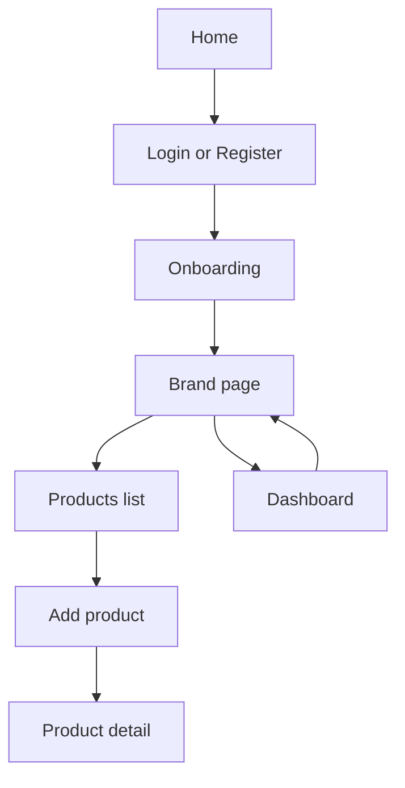
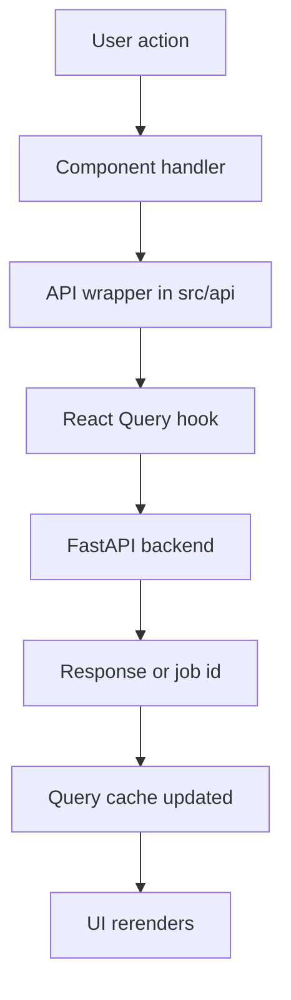
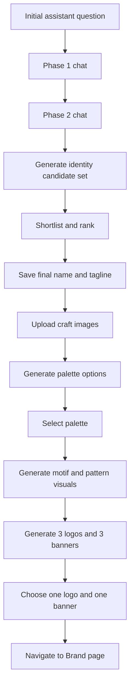
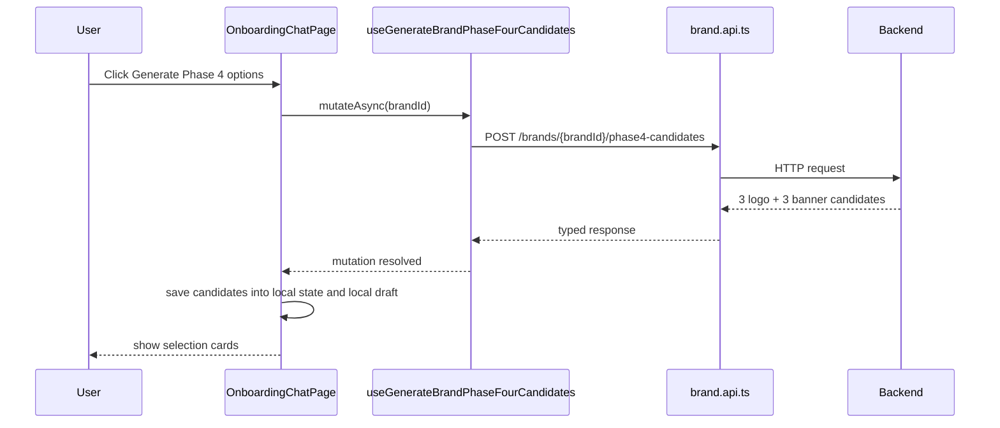

# Idanta Client

This is the React frontend for Idanta. It is the decision-making UI on top of the backend generation engine.

The client is responsible for:

- authentication screens
- onboarding chat UX
- Phase 1 to Phase 4 selection flow
- voice recording and assistant playback
- brand and product pages
- API calls, caching, polling, and local draft persistence

## Frontend Stack

From `package.json`, the main client stack is:

- React 19
- TypeScript
- Vite
- React Router
- TanStack Query
- Zustand
- Axios
- Tailwind CSS
- Lucide React

## Top-Level Structure

```text
client/
├── public/
├── src/
│   ├── api/         # HTTP wrappers
│   ├── components/  # reusable UI
│   ├── hooks/       # query hooks and voice logic
│   ├── lib/         # helpers, i18n, local drafts
│   ├── pages/       # route screens
│   ├── router/      # route configuration
│   ├── store/       # Zustand stores
│   └── types/       # TypeScript contracts
├── package.json
└── README.md
```

## Mental Model

The frontend is not where brand generation happens. The backend does the heavy generation work.

The frontend’s job is to:

1. collect structured inputs
2. show progressive choices
3. persist local UX state
4. call the right backend stage at the right moment
5. present final outputs clearly

So the UI acts more like a guided funnel than a freeform dashboard.

## Routing

Routes are configured in `src/router/index.tsx`.

Main app routes:

- `/`
- `/login`
- `/register`
- `/onboarding`
- `/dashboard`
- `/brand`
- `/products`
- `/products/add`
- `/products/:productId`
- `/jobs/:jobId`

There are:

- protected routes for authenticated users
- auth page redirects if the user is already logged in

## High-Level Screen Map



## State Strategy

The client uses multiple layers of state:

### 1. React local state

Used heavily inside onboarding screens for:

- active phase
- selected identity pair
- selected files
- visual foundation
- phase 4 candidate selections

### 2. TanStack Query

Used for:

- API fetching
- mutation orchestration
- caching
- invalidation after regeneration or selection

### 3. Zustand

Used for:

- auth session state
- UI language state

### 4. Local draft storage

Used for:

- restoring onboarding chat and selections after refresh

This is implemented in:

- `src/lib/onboardingDraft.ts`

## Frontend Data Flow



## API Layer

API wrappers live in `src/api`.

Important files:

- `auth.api.ts`
- `brand.api.ts`
- `chat.api.ts`
- `jobs.api.ts`
- `product.api.ts`
- `assets.api.ts`
- `client.ts`

`client.ts` sets up the shared Axios instance.

The rest of the files are thin, typed wrappers around backend endpoints.

## Hook Layer

Hooks live in `src/hooks`.

Main feature hooks:

- `useAuth`
- `useBrand`
- `useJobs`
- `useProduct`
- `useAssets`
- `useVoiceChat`

### Why the hook layer matters

The pages usually do not call Axios directly. They use query and mutation hooks so that:

- loading state stays consistent
- retry and error handling are centralized
- cache invalidation is easier
- the UI remains focused on interaction logic

## Onboarding Page

The most important screen is:

- `src/pages/onboarding/OnboardingChatPage.tsx`

This file currently coordinates:

- chat messages
- phase transitions
- identity generation
- identity ranking
- image upload for Phase 3
- palette selection
- motif and pattern generation
- Phase 4 logo and banner generation
- local draft persistence
- voice mode

This page is effectively a small frontend state machine.

## Current Onboarding Flow



## Onboarding UX State

The onboarding page stores and restores:

- messages
- extracted form data
- current phase
- completed phases
- draft brand id
- identity sets
- shortlisted pairs
- ranked pairs
- final selected pair
- visual foundation
- Phase 4 candidates
- selected logo candidate id
- selected banner candidate id

This is why onboarding survives refresh much better than a typical uncontrolled chat screen.

## Voice Flow

Voice behavior is implemented in:

- `src/hooks/useVoiceChat.ts`

It supports:

- microphone recording
- transcription
- TTS playback
- streaming speech queueing

Current voice model:

- the user speaks
- audio is transcribed
- transcribed text is fed into the same chat handler
- assistant replies are queued for speech

The onboarding page decides when to call:

- `playSynthesizedSpeech`
- `enqueueSynthesizedSpeech`

so voice is coordinated at the screen level, not hidden inside the hook.

## Language Model On The Client

The client has three UI language codes in `src/store/uiStore.ts`:

- `en`
- `hi`
- `hg`

But onboarding now deliberately uses a fixed chat style layer for simple Hindi written in English letters, regardless of broader app language. That avoids accidental switching into pure Devanagari when the onboarding assistant or voice flow is active.

## Brand Page

The brand page lives in:

- `src/pages/brand/BrandPage.tsx`

It now acts as the final presentation page after onboarding.

It shows:

- final banner hero
- final logo
- name and tagline
- palette
- selected motif previews
- selected pattern previews
- story tabs in English and Hindi
- download controls
- regenerate controls

## Brand Page Data Dependencies

The page reads the latest completed brand through:

- jobs query
- latest completed brand job
- `useBrand(latestBrandId)`

That means the brand page is driven by the latest successful brand record rather than by temporary onboarding-only state.

## Product Screens

Product-related pages live in:

- `src/pages/product/ProductListPage.tsx`
- `src/pages/product/AddProductPage.tsx`
- `src/pages/product/ProductDetailPage.tsx`

Responsibilities:

`ProductListPage`

- shows product inventory

`AddProductPage`

- collects product metadata
- uploads photos
- submits category-specific `category_data`

`ProductDetailPage`

- shows generated product assets
- supports download and viewing

## Shared Component Strategy

Reusable UI is split by domain:

- `components/chat`
- `components/brand`
- `components/product`
- `components/layout`
- `components/ui`

This keeps route screens from carrying all UI markup directly.

## Type Contracts

Types live in `src/types`.

Most important:

- `brand.types.ts`
- `product.types.ts`
- `job.types.ts`
- `auth.types.ts`

These mirror backend payloads closely and are important for keeping the staged onboarding flow safe as the data model grows.

## i18n And Copy

Basic language copy helpers live in:

- `src/lib/i18n.ts`

This is lightweight i18n, not a full translation framework.

It is used mostly for:

- UI labels
- prompts
- helper text
- action labels

## Local Draft Persistence

`src/lib/onboardingDraft.ts` is one of the most important support files in the client.

It persists onboarding state between reloads so the user does not lose:

- chat transcript
- draft brand selections
- visual foundation progress
- Phase 4 selections

That file is what makes onboarding feel resumable.

## How A Typical Interaction Works

Example: generating Phase 4 options.



## Build And Dev

### Install

```powershell
npm install
```

### Run dev server

```powershell
npm run dev
```

### Build

```powershell
npm run build
```

### Lint

```powershell
npm run lint
```

## Important Env

Create `client/.env` from `.env.example`.

Main variable:

- `VITE_API_URL=http://localhost:8000`

## How To Read The Client Code

A good reading order is:

1. `src/router/index.tsx`
2. `src/store/authStore.ts`
3. `src/store/uiStore.ts`
4. `src/api/client.ts`
5. `src/api/brand.api.ts`
6. `src/hooks/useBrand.ts`
7. `src/pages/onboarding/OnboardingChatPage.tsx`
8. `src/pages/brand/BrandPage.tsx`
9. `src/pages/product/*`

That gives you a clean path from app shell to API usage to the most important screens.

## How The Frontend Code Is Written

The codebase mostly follows these patterns:

- route pages own interaction flow
- hooks own remote-state orchestration
- API modules stay thin and typed
- shared UI components stay reusable and mostly presentation-focused
- local draft logic is separated from view rendering

In practical terms, that means the onboarding page is large because it is the orchestrator, while smaller helper files keep the repeated logic out of the JSX where possible.

