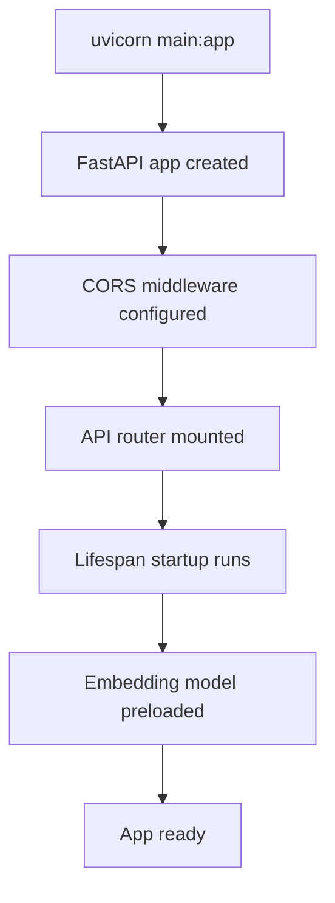
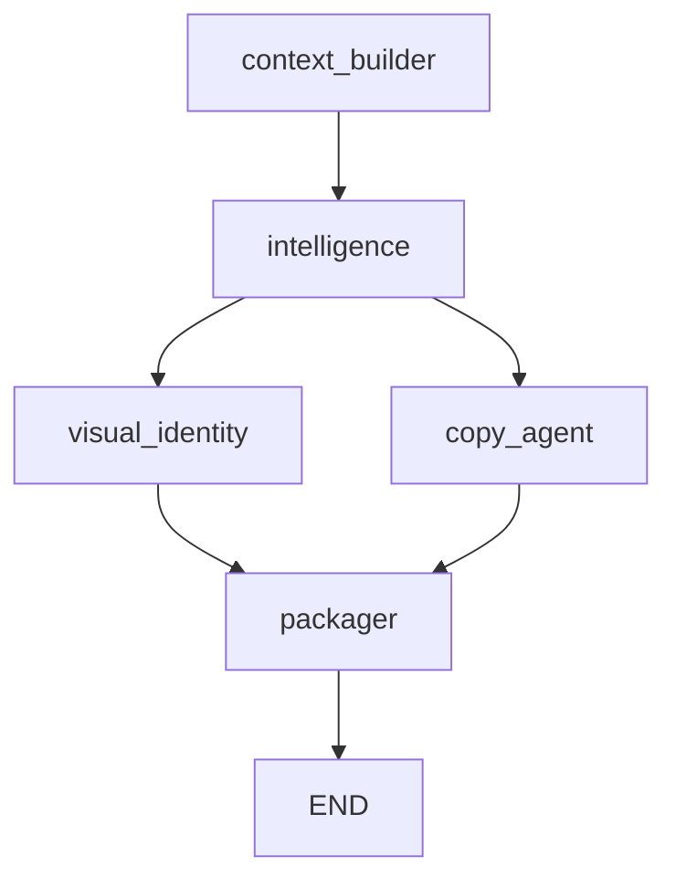
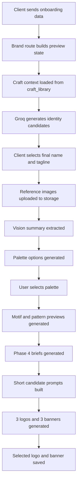
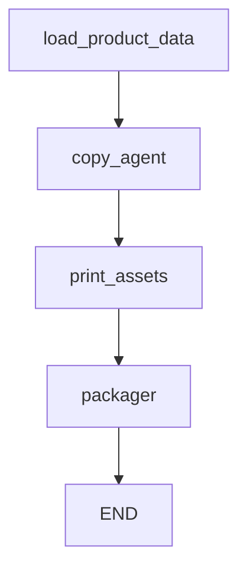

# Idanta Server

This is the FastAPI backend for Idanta. It is responsible for:

- auth and user-bound API access
- brand and product generation APIs
- orchestration through LangGraph
- craft retrieval and prompt enrichment
- image and text generation
- asset packaging and storage uploads
- job status tracking

## Backend Purpose

The backend is not just a CRUD API. It behaves more like a generation engine with a database-backed workflow layer.

At a high level it does four things:

1. stores user, brand, product, and job records in Supabase
2. turns artisan context into structured generation state
3. runs generation workflows through graph nodes
4. persists final assets and makes them available to the client

## Top-Level Structure

```text
server/
├── app/
│   ├── agents/        # LangGraph state, nodes, and graphs
│   ├── api/           # FastAPI routes and dependencies
│   ├── core/          # config, DB, auth utilities
│   ├── models/        # Pydantic models and domain enums
│   ├── rag/           # embedding, indexing, retrieval
│   └── services/      # LLM clients, image generation, prompt assembly, storage
├── data/
│   ├── craft_library/
│   ├── logo_sample/
│   ├── brand_verbal_pool.json
│   ├── brand_visual_pool.json
│   ├── design_pool.json
│   └── database_schema.sql
├── main.py
└── requirements.txt
```

## Startup Flow

`main.py` creates the app, loads CORS, mounts the main router, and preloads the sentence-transformer embedding model during startup so the first RAG request is not cold.



## Main HTTP Surface

The root router is defined in `app/api/router.py`.

Mounted route groups:

- `/api/v1/auth`
- `/api/v1/chat`
- `/api/v1/brands`
- `/api/v1/products`
- `/api/v1/jobs`

Health route:

- `GET /api/v1/health`

## Core Architectural Layers

### 1. Route layer

Located in `app/api/routes`.

This layer:

- validates incoming requests
- reads or writes DB rows
- creates jobs
- builds initial graph state
- starts generation or regeneration logic

### 2. Graph layer

Located in `app/agents/graphs` and `app/agents/nodes`.

This layer:

- converts a brand or product into stateful workflow execution
- sequences nodes
- merges node outputs into one state object
- writes failures back into `jobs`

### 3. Service layer

Located in `app/services`.

This layer:

- talks to Groq
- generates images
- uploads files to storage
- builds prompts
- analyzes internal logo references

### 4. Data layer

Located in `app/core`, `app/models`, and `data/`.

This layer:

- defines schema and enums
- connects to Supabase
- exposes local craft and design libraries

## Brand System Overview

The brand backend currently supports both:

- full background brand generation
- incremental onboarding stages used by the client

## Brand Routes

Main brand routes in `app/api/routes/brand.py` include:

- `GET /brands/crafts`
- `POST /brands/identity-candidates`
- `POST /brands/identity-rank`
- `POST /brands/identity-draft`
- `POST /brands/visual-foundation`
- `PATCH /brands/{brand_id}/palette-selection`
- `POST /brands/{brand_id}/phase4-candidates`
- `PATCH /brands/{brand_id}/phase4-selection`
- `POST /brands/`
- `POST /brands/upload-images`
- `GET /brands/{brand_id}`
- `POST /brands/{brand_id}/generate`
- `POST /brands/{brand_id}/regenerate-asset`
- `PATCH /brands/{brand_id}/identity`

## Brand State Construction

Brand routes convert DB rows or request payloads into a `BrandState`. That state is the shared contract for graph nodes and service functions.

The state typically carries:

- user id
- job id
- brand id
- craft id
- artisan and market context
- palette
- story fields
- selected motifs and patterns
- asset URLs
- context bundle and craft data

## Brand Graph

The main graph lives in `app/agents/graphs/brand_graph.py`.

Nodes:

- `context_builder`
- `intelligence`
- `visual_identity`
- `copy_agent`
- `packager`

Flow:



### Node responsibilities

`context_builder`

- loads craft metadata
- prepares structured state
- enriches generation context

`intelligence`

- reasons about verbal and strategic direction
- builds foundations for name, tagline, and narrative outputs

`visual_identity`

- generates brand-level visual assets or visual direction
- uses image-generation services and prompt helpers

`copy_agent`

- writes brand story and supporting text outputs

`packager`

- assembles final outputs
- uploads files
- creates downloadable brand-kit ZIPs

## Onboarding-Specific Brand Flow

The onboarding flow used by the frontend is more staged than the full graph.

### Identity generation

`POST /brands/identity-candidates`

Uses:

- onboarding form data
- craft context
- curated verbal examples

to generate six name/tagline pairs per set.

### Identity ranking

`POST /brands/identity-rank`

Ranks shortlisted pairs and returns:

- ranked order
- recommendation
- next prompt for the user

### Visual foundation

`POST /brands/visual-foundation`

Analyzes uploaded reference images and builds:

- visual summary
- visual motifs
- palette options
- recommended palette
- selected palette aware motif/pattern previews when requested

### Phase 4 candidates

`POST /brands/{brand_id}/phase4-candidates`

Generates:

- 3 logo candidates
- 3 banner candidates

using:

- selected brand name and tagline
- selected Phase 3 palette
- motif and pattern system
- internal logo sample library

### Phase 4 selection

`PATCH /brands/{brand_id}/phase4-selection`

Persists the chosen:

- `logo_url`
- `banner_url`

## Brand Onboarding Data Flow



## Why Phase 4 Works The Way It Does

Phase 4 is intentionally split into:

1. brief planning
2. compact candidate prompt generation
3. image generation

This matters because the image service truncates long prompts. The backend now:

- creates three structurally different logo briefs
- creates three structurally different banner briefs
- builds short, high-signal prompts to stay under prompt-length limits

That reduces convergence and keeps candidates visibly distinct.

## Internal Reference Injection

The backend uses `server/data/logo_sample` as an internal curated design reference library.

Handled by:

- `app/services/logo_reference_service.py`

This service:

- discovers sample files
- uploads a subset to storage
- summarizes shared design language through vision and JSON shaping
- caches the summary
- injects that summary into Phase 4 prompt building

This is backend-controlled reference injection, not user-uploaded logo inspiration.

## Prompt Assembly

Prompt assembly is distributed across:

- `app/services/asset_prompt_service.py`
- helpers inside `app/api/routes/brand.py`
- node-level orchestration logic

Important idea:

- the backend does not rely on one giant generic prompt
- it builds context-aware prompts from multiple smaller sources

Typical prompt ingredients:

- craft metadata
- artisan story
- palette
- motif and pattern language
- curated verbal pool
- curated visual pool
- internal logo sample summary

## RAG Layer

The retrieval system lives in `app/rag`.

Files:

- `embedder.py`
- `indexer.py`
- `retriever.py`

Purpose:

- embed craft knowledge
- persist or expose retrieval context
- enrich generation with craft-specific facts rather than relying on generic model memory

Local craft source files live in:

- `data/craft_library/*.json`

Run indexing after schema and environment setup:

```powershell
python -m app.rag.indexer
```

## Product System Overview

The product pipeline is graph-driven too, but simpler than the brand pipeline.

## Product Routes

Main product routes in `app/api/routes/product.py`:

- `POST /products/`
- `GET /products/{product_id}`
- `POST /products/{product_id}/generate`

### Product creation

The create route:

- accepts `multipart/form-data`
- validates `category`
- parses and validates `category_data`
- uploads photos
- stores the product row in Supabase

### Product generation

The generate route:

- creates a job
- loads parent brand context
- invokes the product graph

## Product Graph

The product graph lives in `app/agents/graphs/product_graph.py`.

Nodes:

- `load_product_data`
- `copy_agent`
- `print_assets`
- `packager`

Flow:



`load_product_data` merges:

- product row
- parent brand row
- craft JSON

into one `ProductState`.

That means every product generation uses both product-specific metadata and brand-level identity context.

## Storage And Packaging

Storage responsibilities live in:

- `app/services/storage_service.py`

Packaging responsibilities are handled in graph nodes and helpers. Outputs are uploaded to storage and the resulting public URLs are written back into DB rows.

Typical persisted asset URLs include:

- logo
- banner
- branded photo
- hang tag
- label
- story card
- certificate
- kit zip

## Jobs

Jobs are the async progress-tracking layer between client and backend.

Each long-running generation action:

- creates a job row
- updates progress and current step
- stores `done` or `failed`
- lets the client poll until completion

This is why the frontend can show progress without waiting on one blocking HTTP request.

## Database

The schema is defined in:

- [database_schema.sql](/c:/Users/sir_anmol/Desktop/Idanta/server/data/database_schema.sql)

Important tables include:

- `users`
- `brands`
- `products`
- `jobs`

Recent brand fields now include:

- artisan and region context
- language preferences
- uploaded reference images
- visual summary
- motif previews
- signature patterns
- palette options
- recommended and selected palette ids

Recent product fields now include:

- category
- occasion
- time to make
- description voice
- category-specific JSON data
- story card and certificate URLs

## Environment Variables

Common required variables include:

- `SUPABASE_URL`
- `SUPABASE_ANON_KEY`
- `SUPABASE_SERVICE_ROLE_KEY`
- `SUPABASE_STORAGE_BUCKET`
- `JWT_SECRET_KEY`
- `GROQ_API_KEY`
- `GROQ_MODEL`
- `GEMINI_API_KEY`
- `GEMINI_VISION_MODEL`
- `EMBEDDING_MODEL`
- `RAG_TOP_K`
- `CORS_ORIGINS`

Create `server/.env` manually if you do not already have one.

## Setup

```powershell
python -m venv venv
.\venv\Scripts\activate
pip install -r requirements.txt
python -m app.rag.indexer
uvicorn main:app --reload
```

## Dependency Snapshot

Main dependencies from `requirements.txt`:

- FastAPI
- Uvicorn
- Supabase
- python-jose
- passlib
- Groq
- LangChain
- LangGraph
- sentence-transformers
- httpx
- Sarvam AI client
- Pillow

## How To Read The Backend Code

A useful reading order is:

1. `main.py`
2. `app/api/router.py`
3. `app/api/routes/brand.py`
4. `app/api/routes/product.py`
5. `app/agents/graphs/brand_graph.py`
6. `app/agents/graphs/product_graph.py`
7. `app/services/asset_prompt_service.py`
8. `app/services/logo_reference_service.py`
9. `data/craft_library/*`

That order gives the clearest picture of how requests turn into generation state and then into persisted assets.

